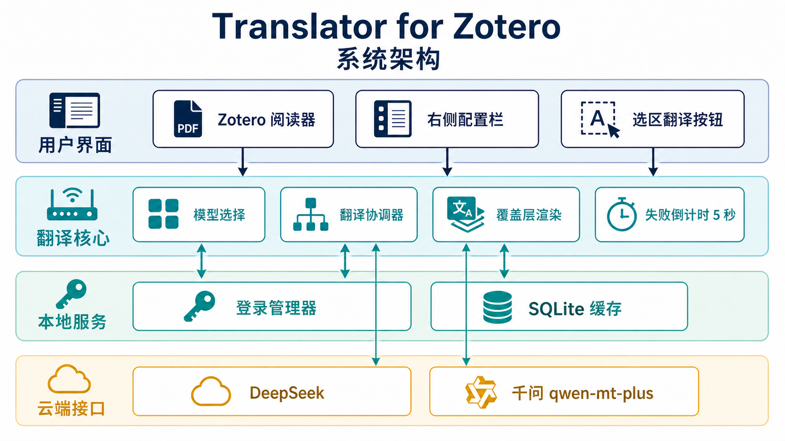
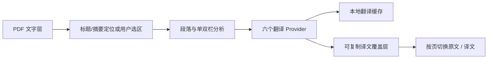

# 📚 Translator for Zotero

[](https://github.com/Kumiko-kmk/Translator-for-Zotero/releases/latest)
[](https://www.zotero.org/)

在 Zotero 内置 PDF 阅读器中翻译论文标题、摘要和手动选中的正文，并直接阅读、选择和复制中文译文。

> 🚀 当前版本：`2.0.0`
>
> 🧩 支持范围：Zotero `9.0`–`9.*` · 带可复制文字层的 PDF · 简体中文译文

[📦 下载安装包](https://github.com/Kumiko-kmk/Translator-for-Zotero/releases/latest) · [🏗️ 架构交接](docs/HANDOFF.md) · [🛠️ 开发指南](docs/DEVELOPMENT.md) · [🗒️ 版本记录](CHANGELOG.md) · [🐞 提交问题](https://github.com/Kumiko-kmk/Translator-for-Zotero/issues)


## ✨ 功能

- **标题与摘要自动翻译**：读取 Zotero 父条目元数据，定位 PDF 首页中的标题和摘要区域。
- **选区段落翻译**：在 PDF 中选中文字后点击“翻译”，自动补全视觉行并识别单栏、双栏和段落边界。
- **原版面覆盖**：译文覆盖原文位置，保留首行缩进、连续段落语义和分栏布局。
- **可选择、可复制**：译文支持正常拖拽选择，不会因点击覆盖块切回原文。
- **按页显示切换**：页面顶部和底部均可切换该页全部成功译文与原文。
- **自适应排版**：联合搜索字号和行距，在不溢出的前提下尽量填充原文覆盖区域。
- **轻量化渲染**：只挂载当前页及前后各一页的覆盖层，并缓存坐标与排版结果。
- **六 Provider**：支持千问、DeepSeek、Gemini、Bing、Transmart 和 CNKI，配置与缓存相互隔离。
- **本地安全存储**：API Key 保存于 Zotero/Firefox Login Manager；成功译文缓存在本地 SQLite。

2.0.0 将插件运行时拆分为职责清晰的功能模块，并完成六 Provider、模型选择面板、结果预览与选区覆盖定位的整合。产品边界保持不变：插件只自动翻译标题和摘要；正文由用户主动选择，从而避免公式、表格、图片标签等内容被批量误译。

## 🧭 界面与架构





## 📦 安装

1. 从 [GitHub Releases](https://github.com/Kumiko-kmk/Translator-for-Zotero/releases/latest) 下载最新版 `Translator-for-Zotero-*.xpi`。
2. 打开 Zotero，进入 `工具（Tools） → 插件（Plugins）`。
3. 将 XPI 拖入插件窗口并确认安装。
4. **完全退出并重新启动 Zotero**。
5. 打开一个带文字层的 PDF，在右侧栏找到 **Translator for Zotero**。

不要解压 XPI。若提示版本不兼容，请确认 Zotero 为 9.x，并从 Releases 重新下载正式附件，而不是手工压缩源码目录。

## 🔑 配置翻译服务

在 PDF 右侧栏中：

1. 先选择一个翻译模型。
2. Qwen、DeepSeek、Gemini 输入对应的 API Key；Bing、Transmart、CNKI 无需密钥。
3. 需要密钥的 Provider 点击“保存”，等待验证完成。
4. 先翻译一两句话，确认网络、权限和额度正常。

六个 Provider 的密钥、模型和缓存互不混用。切换 Provider 只影响后续请求，不会修改已经显示的译文。未选择模型时不会发起翻译。

模型选择面板使用插件内置的高清图标，卡片只显示英文模型名。未选择模型时，当前模型栏显示“选择翻译模型”；选择后只显示模型英文名。模型卡片使用横向布局，图标浮在左侧，名称位于右侧。

## 📝 使用方法

### 📰 标题和摘要

打开具有父条目的 PDF 后，插件会读取父条目的 `title` 与 `abstractNote`，再在第一页定位相应区域。定位或翻译失败时，可在侧栏分别重试标题、摘要，或全部重试。

### ✂️ 正文选区

1. 在 PDF 中拖选英文正文。
2. 在选区弹窗底部点击“翻译”。
3. 等待译文覆盖原文区域。
4. 直接拖拽选择并复制译文。
5. 需要核对时，使用页面顶部或底部按钮切换原文/译文。

为获得更稳定的段落识别结果：

- 尽量从单词边界开始和结束；
- 同一次选择不要横跨左右两栏；
- 公式、表格和图内标签建议分开处理；
- 扫描版 PDF 需先通过外部工具添加 OCR 文字层。

## 🔒 隐私与费用

插件只向当前选择的 Provider 发送本次需要翻译的标题、摘要或选区文本，不会上传整个 PDF，也不会修改原文件。

- 不要将真实 API Key 写入代码、Issue、截图或日志。
- 未发表论文、患者数据和企业内部材料应先确认允许发送到第三方服务。
- API 价格、地域、额度和速率限制以服务商最新政策为准。

## ⚠️ 当前限制

- 仅支持 Zotero 9.x 内置 PDF Reader 的普通主视图；
- 目标语言固定为简体中文；
- 不包含 OCR，不支持纯扫描图片 PDF；
- 不支持 EPUB、第二阅读器视图和整页正文翻译；
- 复杂公式、表格、脚注和浮动文本框可能影响选区定位；
- 当前没有翻译历史浏览、导出或批量管理页面。

## 🗂️ 仓库结构

```text
Translator-for-Zotero/
├─ plugin/
│  ├─ bootstrap.js         # 生命周期与模块加载器
│  ├─ core.js              # 公共常量、元数据与通用工具
│  ├─ app-controller.js    # Reader、侧栏与应用状态协调器
│  └─ ...                  # 定位、翻译、覆盖层和 Provider 模块
├─ tools/build_xpi.ps1     # 唯一受支持的 XPI 构建入口
├─ docs/
│  ├─ HANDOFF.md           # 架构、模块职责、状态与维护边界
│  ├─ DEVELOPMENT.md       # 环境、验收、构建和发布流程
│  └─ images/              # README 使用的流程与架构图
├─ CHANGELOG.md            # 版本变化记录
└─ README.md               # 项目主页（GitHub 文件列表下方自动渲染）
```

旧原型、历史运行日志和 XPI 不再混放在源码树中。正式安装包以 [GitHub Releases](https://github.com/Kumiko-kmk/Translator-for-Zotero/releases) 为唯一分发位置，本地构建产物写入已忽略的 `dist/`。

## 🛠️ 开发与构建

架构、模块依赖和状态所有权见 [docs/HANDOFF.md](docs/HANDOFF.md)；环境准备、人工验收和发布流程见 [docs/DEVELOPMENT.md](docs/DEVELOPMENT.md)。基础语法检查和构建流程：

```powershell
Get-ChildItem plugin -Filter *.js | ForEach-Object { node --check $_.FullName }
.\tools\build_xpi.ps1
```

构建脚本从 `plugin/manifest.json` 读取版本，验证插件 ID、Zotero 兼容范围、根目录结构和固定文件清单，再生成：

```text
dist/Translator-for-Zotero-<version>.xpi
```

## 💬 反馈

提交 Issue 时请附上：Zotero 版本、操作系统、PDF 是单栏还是双栏、可复现步骤和已隐藏敏感信息的截图。请勿上传论文全文、真实 API Key 或包含隐私数据的日志。
