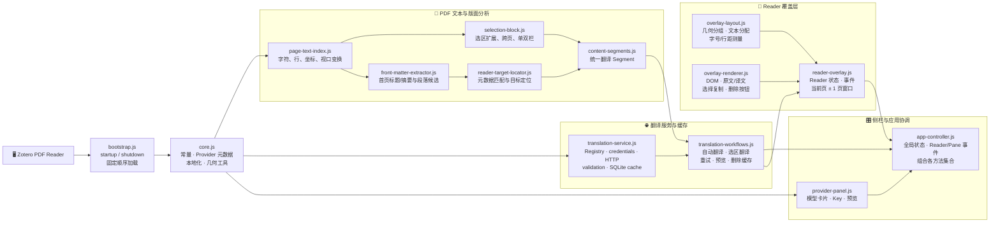
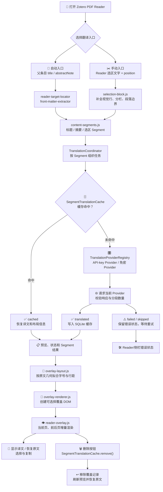

# 📚 Translator for Zotero

[](https://github.com/Kumiko-kmk/Translator-for-Zotero/releases/latest)
[](https://www.zotero.org/)
[](https://github.com/Kumiko-kmk/Translator-for-Zotero)

在 Zotero 内置 PDF Reader 中翻译论文标题、摘要和用户选中的正文，并直接阅读、选择、复制中文译文。📝✨

> 🚀 **当前版本**：`2.0.0`<br>
> 🧩 **支持范围**：Zotero `9.x` · 带可复制文字层的 PDF · 简体中文 `zh-CN`<br>
> 🛠️ **项目形态**：无 npm 依赖的 Zotero Bootstrap 插件，源码直接由 Zotero 加载<br>
> 🚧 **本地审阅分支**：包含尚未发布的首次使用提示、单段缓存删除和文档更新

[📦 下载安装包](https://github.com/Kumiko-kmk/Translator-for-Zotero/releases/latest) · [🛠️ 开发与构建](docs/DEVELOPMENT.md) · [🗒️ 版本记录](CHANGELOG.md) · [🐞 提交问题](https://github.com/Kumiko-kmk/Translator-for-Zotero/issues)

## 🌟 项目简介

Translator for Zotero 面向需要阅读英文论文的 Zotero 用户。它不修改原始 PDF，也不把整篇论文上传到服务商，而是把当前需要翻译的标题、摘要或用户选区发送给所选 Provider，再把中文结果覆盖到原文对应位置。

插件的产品边界很明确：📌 **标题和摘要可以自动处理；正文必须由用户主动选择。** 这样可以减少公式、表格、图注和浮动文本被误识别后批量翻译的问题，同时保留读者对翻译范围的控制。

## ✨ 核心能力

| 能力 | 说明 |
| --- | --- |
| 📰 标题/摘要自动翻译 | 读取 Zotero 父条目的 `title` 与 `abstractNote`，在 PDF 首页匹配对应区域 |
| ✂️ 选区翻译 | 从 Reader 选区位置出发，补全视觉行，识别单栏、双栏、跨页和段落边界 |
| 🧱 原版面覆盖 | 在原文坐标上布局中文，不修改 PDF 文件本身 |
| 🖱️ 译文选择与复制 | 成功译文保持可选择、可复制，页面按钮不会混入复制文本 |
| 🔄 原文/译文切换 | 页面顶部和底部都可以切换当前页的显示状态 |
| 🗑️ 单段缓存删除 | 删除成功译文的缓存和覆盖块，并恢复对应原文 |
| ⚡ 轻量渲染 | 只保留当前页及前后各一页的覆盖层，坐标和排版结果可复用 |
| 🌐 多 Provider | 支持 6 个 Provider，各自隔离模型、凭据、错误状态和缓存 |
| 🔐 本地安全存储 | API Key 进入 Zotero/Firefox Login Manager，翻译缓存进入本地 SQLite |

## 📦 安装

### ✅ 使用前提

- 🦊 Zotero `9.x`，使用内置 PDF Reader 的普通主视图；
- 📄 PDF 需要有可复制的文字层；扫描版 PDF 请先通过外部工具 OCR；
- 🌏 当前目标语言固定为简体中文 `zh-CN`；
- 🌐 需要网络访问当前选中的 Provider。

### 📥 安装步骤

1. 从 [GitHub Releases](https://github.com/Kumiko-kmk/Translator-for-Zotero/releases/latest) 下载 `Translator-for-Zotero-*.xpi`。
2. 打开 Zotero，进入 `工具（Tools） → 插件（Plugins）`。
3. 将 XPI 拖入插件窗口并确认安装。
4. **完全退出并重新启动 Zotero**，不要只关闭当前 PDF 标签页。
5. 打开带文字层的 PDF，在右侧栏找到 **Translator for Zotero**。

⚠️ 不要解压 XPI，也不要手工压缩源码目录替代 XPI。若提示版本不兼容，请确认 Zotero 为 9.x，并从 Releases 重新下载正式附件。

### 👋 首次使用提示

第一次点击 Provider/模型卡片时，插件会显示选区使用须知：

1. 尽量一次只翻译一段文字；
2. 不建议跨页、跨栏划选；
3. 避免把页眉、页码等内容混入选区。

提示弹窗会短暂锁定确认按钮，之后可以点击“我知道了，开始使用”、关闭按钮或按 `Esc`。确认后不会重复显示，除非 Zotero 偏好被清除。

## 🌐 Provider 与模型

| Provider | 内置模型 | 凭据 | 适用说明 |
| --- | --- | --- | --- |
| 🟣 Qwen | `qwen-mt-plus` | API Key | 面向翻译任务的兼容接口；每次请求处理一个分段 |
| 🔵 DeepSeek | `deepseek-v4-flash` | API Key | 结构化返回翻译结果并校验分段对应关系 |
| 🌈 Gemini | `gemini-2.5-flash` | API Key | 使用官方 Gemini API，返回空结果或阻止响应会明确报错 |
| 🔷 Bing | `bing-edge` | 免密 | 网页/内部接口，可能受到限流、地区网络和接口变化影响 |
| 🟢 Tencent Transmart | `transmart-web` | 免密 | 网页接口，复杂网络环境下可能需要重试 |
| 🟠 CNKI | `cnki-web` | 免密 | 需要临时 Token，可能触发验证码或接口限制 |

### 🔑 API Key 与模型选择

- Qwen、DeepSeek、Gemini 的 Key 由 Zotero/Firefox Login Manager 管理，不写入源码、日志、截图或 Git 历史。
- Bing、Tencent Transmart、CNKI 不显示 Key 配置区，但不代表它们提供稳定的官方开发者 API。
- 未选择模型时，当前 Provider ID 为空，不发起翻译请求，也不写入翻译缓存。
- 切换 Provider 只影响后续请求，不会自动修改已经显示的译文，也不会跨 Provider 复用缓存。
- Provider 失败后不会静默切换其他服务，请检查网络、Key、额度和服务状态后手动重试。

## 📝 使用方法

### 📰 自动翻译标题和摘要

1. 确认 PDF 是 Zotero 条目的附件，并且存在父条目元数据。
2. 打开 PDF 后，插件读取父条目的 `title` 和 `abstractNote`。
3. `reader-target-locator.js` 联合首页文本和版面分析，定位标题/摘要覆盖区域。
4. 侧栏显示翻译状态和预览；失败时可以分别重试标题、摘要或全部任务。

定位需要同时满足文字匹配、版面候选和置信度条件。复杂首页、出版商元数据、脚注或扫描 PDF 可能导致目标被跳过，这时插件会保留明确状态，而不是把不确定内容强行覆盖。

### ✂️ 手动翻译正文选区

1. 在 PDF 中拖选英文正文。
2. 在 Reader 选区弹窗底部点击“翻译”。
3. 插件使用 Reader 提供的字符位置和 PDF 坐标，而不是只依赖全文模糊搜索。
4. 等待译文覆盖原文区域后，直接拖拽选择并复制译文。
5. 需要核对时，使用页面顶部或底部的原文/译文切换按钮。
6. 如果成功译文旁边出现 `×` 删除按钮，可以删除该段缓存并恢复原文。

为了提高定位稳定性：

- ✅ 尽量从完整单词边界开始和结束；
- ✅ 一次选择一个自然段或连续的一小段内容；
- ⚠️ 不要横跨左右栏、页眉、页脚或页码；
- ⚠️ 公式、表格、图片标签和脚注建议分开处理；
- 🧪 跨页选区可以使用，但版面复杂时应优先分段翻译。

### 🗑️ 删除单段译文

删除按钮只对状态为 `cached` 或 `translated` 且译文非空的覆盖块显示。点击后会：

1. 从 SQLite 删除包含附件、位置、源文哈希、Provider、模型和提示词版本的缓存记录；
2. 从当前 Reader 的覆盖记录移除该 Segment；
3. 恢复原文显示并刷新预览和状态栏。

删除失败时不会静默丢失状态，按钮会恢复可用，并在 Reader 状态栏显示错误原因。

## 🏗️ 系统架构

下面的架构图对应当前 `plugin/bootstrap.js` 的固定加载顺序和各模块的实际职责。插件没有 npm 打包器；`bootstrap.js` 通过 Zotero 的 `Services.scriptloader.loadSubScript()` 把 13 个模块加载到同一个全局环境中，最后启动应用控制器。

### 🧩 图 1：模块架构与职责边界



### 🔁 图 2：自动翻译、选区翻译与缓存流程



## 🔐 隐私、缓存与安全边界

- 📤 只向当前 Provider 发送需要翻译的标题、摘要或用户选区文本，不上传整个 PDF。
- 📝 不修改原始 PDF，不把译文写回附件文件。
- 🔑 API Key 通过 Zotero/Firefox Login Manager 保存；请勿写入 README、Issue、截图、日志或测试数据。
- 🗄️ 成功译文缓存在 Zotero 数据目录的 SQLite 中，缓存键隔离附件、Segment、源文哈希、源/目标语言、Provider、模型和提示词版本。
- 🔄 Provider 切换不会复用其他 Provider 的缓存；删除单段译文只删除对应缓存和当前覆盖块。
- ⚠️ Bing、Tencent Transmart、CNKI 使用网页或内部接口，可能受到地区网络、验证码、限流和接口变更影响。
- 💰 API 价格、地域、额度、隐私政策和速率限制以服务商最新政策为准。

涉及未发表论文、患者数据、企业内部材料或其他敏感文档时，请先确认所在机构允许把相关文本发送给第三方翻译服务。

## ⚠️ 当前限制

- 🦊 仅支持 Zotero 9.x 内置 PDF Reader 的普通主视图；
- 🌏 目标语言固定为简体中文；
- 🔍 不包含 OCR，不支持纯扫描图片 PDF；
- 📚 不支持 EPUB、第二 Reader 视图和整页正文翻译；
- 🧮 复杂公式、表格、脚注、页眉页码和浮动文本框可能影响定位；
- 🧾 没有翻译历史浏览、导出或批量管理页面；
- 🔌 Provider 的免密接口不承诺长期稳定，失败时需要手动重试或切换 Provider。

## 🗂️ 仓库结构

```text
Translator-for-Zotero/
├─ plugin/
│  ├─ bootstrap.js                 # Zotero 生命周期与模块加载器
│  ├─ core.js                      # 公共常量、Provider 元数据和工具
│  ├─ page-text-index.js           # PDF.js 页面文字与坐标索引
│  ├─ selection-block.js           # 用户选区与单双栏段落整理
│  ├─ front-matter-extractor.js    # 首页标题/摘要版面分析
│  ├─ reader-target-locator.js     # 父条目元数据与 PDF 目标定位
│  ├─ content-segments.js          # 翻译 Segment 统一模型
│  ├─ translation-service.js       # Provider、凭据、请求和 SQLite 缓存
│  ├─ overlay-layout.js             # 覆盖块几何与排版测量
│  ├─ overlay-renderer.js           # 覆盖 DOM、状态和交互按钮
│  ├─ reader-overlay.js             # Reader 状态、事件和三页窗口
│  ├─ provider-panel.js             # Provider 卡片、Key、预览和复制
│  ├─ translation-workflows.js      # 自动/选区翻译、重试和删除
│  ├─ app-controller.js             # 插件级状态与事件协调
│  ├─ manifest.json                 # 版本、ID 和 Zotero 兼容范围
│  ├─ icons/                        # Provider 与插件本地图标
│  └─ locale/                       # en-US / zh-CN FTL 字符串
├─ docs/DEVELOPMENT.md              # 开发、构建、验收和发布指南
├─ tools/build_xpi.ps1              # 唯一受支持的 XPI 构建入口
├─ CHANGELOG.md                     # 当前版本与未发布变更
└─ README.md                        # 用户入口、架构和使用说明
```

📌 `dist/`、`logs/`、`tmp/`、`data/` 和 `.venv/` 只属于本地构建或运行环境，不提交到仓库。XPI 只从固定 `$packageFiles` 清单生成，不包含 README、开发文档、日志或临时文件。

## 🧪 开发与构建

本地开发不需要 npm 安装。运行以下命令检查 JavaScript 并生成 XPI：

```powershell
Get-ChildItem plugin -Filter *.js | ForEach-Object { node --check $_.FullName }
git diff --check
.\tools\build_xpi.ps1
```

构建脚本从 `plugin/manifest.json` 读取版本，校验插件 ID、Zotero 兼容范围、根目录结构和固定文件清单，最后生成：

```text
dist/Translator-for-Zotero-<version>.xpi
```

更完整的模块职责、状态边界、人工验收和发布检查见 [docs/DEVELOPMENT.md](docs/DEVELOPMENT.md)。

## 🆘 常见问题

### 侧栏没有出现？

确认已完全重启 Zotero，并查看 Zotero Error Console。插件需要等待 Reader 和 Item Pane 管理器就绪；如果注册失败，先关闭 PDF 再重新打开。

### 为什么选区没有译文？

检查 PDF 是否有文字层、Provider 是否已选择、Key 是否验证成功，以及选区是否混入栏间空白、页码或复杂公式。先用短句测试，再逐步扩大选区。

### 译文为什么选不中？

确认当前页面处于“显示译文”状态。成功覆盖层的文本节点允许 `user-select: text`；页面控制按钮和删除按钮不会作为译文复制内容。

### 如何清除某一段错误译文？

点击该覆盖块旁边的 `×`。插件会删除对应缓存、移除覆盖块并恢复原文；如果按钮提示失败，请查看 Reader 状态栏和 Zotero Error Console。

### 为什么翻译服务失败？

按顺序检查 Provider、API Key、账号模型权限、网络、额度、地区端点和服务限流。免密 Provider 还可能遇到验证码或网页接口变更；插件不会自动切换服务。

## 💬 反馈与贡献

提交 Issue 或 PR 时请附：

- 🦊 Zotero 版本和操作系统；
- 📄 PDF 是单栏、双栏还是跨页场景；
- 🔁 最小可复现步骤和错误发生的模块/Provider；
- 🖼️ 已隐藏论文内容、个人信息和 Key 的截图；
- 🧪 已运行的语法检查、构建结果和 XPI SHA-256。

🚫 请勿上传论文全文、真实 API Key、Zotero 个人资料目录或包含敏感内容的原始日志。
