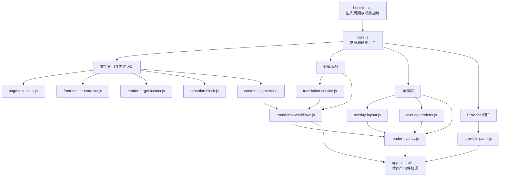

# Translator for Zotero 架构交接

本文档面向接手 Translator for Zotero 2.x 的开发者，说明运行架构、模块职责、状态所有权、关键数据流和不可破坏的维护边界。环境准备、构建、人工验收和发布命令见 [DEVELOPMENT.md](DEVELOPMENT.md)，用户功能说明见 [README.md](../README.md)。

## 1. 当前产品边界

- 运行于 Zotero `9.0`–`9.*` 内置 PDF Reader。
- 自动处理父条目标题和摘要；正文只处理用户主动选择的文本。
- 目标语言固定为简体中文 `zh-CN`。
- 支持 Qwen、DeepSeek、Gemini、Bing、Tencent Transmart 和 CNKI。
- Qwen、DeepSeek、Gemini 使用独立 API Key；Bing、Transmart、CNKI 是实验性的免密钥网页/内部接口。
- 不提供 OCR、整页正文翻译、EPUB、第二 Reader 视图、翻译历史或 Provider 自动降级。
- 译文缓存位于 Zotero 数据目录；API Key 只进入 Zotero/Firefox Login Manager。

## 2. 总体架构



插件不使用 npm 打包器。`bootstrap.js` 通过 `Services.scriptloader.loadSubScript()` 按固定顺序把模块加载到同一个 Zotero 全局环境，最后启动 `globalThis.TranslatorForZoteroApp`。

## 3. 模块加载顺序

加载顺序定义在 `plugin/bootstrap.js`，同时也是依赖顺序：

1. `core.js`
2. `page-text-index.js`
3. `selection-block.js`
4. `front-matter-extractor.js`
5. `content-segments.js`
6. `translation-service.js`
7. `reader-target-locator.js`
8. `overlay-layout.js`
9. `overlay-renderer.js`
10. `reader-overlay.js`
11. `provider-panel.js`
12. `translation-workflows.js`
13. `app-controller.js`

新增模块时必须同步修改：

- `plugin/bootstrap.js` 的加载顺序；
- `tools/build_xpi.ps1` 的固定 `$packageFiles` 清单；
- 本文档的模块职责与依赖说明。

## 4. 模块职责

| 模块 | 单一职责 | 主要输出或全局入口 |
| --- | --- | --- |
| `bootstrap.js` | Zotero `startup`、窗口加载、`shutdown` 和脚本加载 | `startup()`、`shutdown()` |
| `core.js` | 插件 ID/版本、Provider UI 元数据、本地化、位置复制与几何通用工具 | `TranslatorCore` |
| `page-text-index.js` | 从 PDF.js 页面数据建立字符、行、坐标和视口投影索引 | `ReaderPageTextIndex` |
| `front-matter-extractor.js` | 首页视觉行、标题/摘要候选、单双栏和段落结构分析 | `ReaderFrontMatterExtractor` |
| `reader-target-locator.js` | 读取 Zotero 父条目元数据，并将标题/摘要匹配到 PDF 坐标 | `ReaderMetadataLoader`、`ReaderTargetLocator` |
| `selection-block.js` | 将用户选区扩展并整理为跨页、分栏、段落化的内容块 | `ReaderSelectionBlock` |
| `content-segments.js` | 把标题、摘要和选区统一转换为翻译 Segment | `ContentSegments` |
| `translation-service.js` | Provider 注册、凭据、HTTP 请求、错误规范化和 SQLite 缓存 | Provider/凭据客户端、`TranslationCoordinator`、`SegmentTranslationCache` |
| `overlay-layout.js` | 覆盖块分组、译文分配、字体与行距测量、布局缓存 | `TranslatorOverlayLayout` |
| `overlay-renderer.js` | 创建覆盖层 DOM、渲染译文、页级原文/译文控制 | `TranslatorOverlayRenderer` |
| `reader-overlay.js` | 管理每个 Reader 的覆盖记录、事件、三页渲染窗口和增量更新 | `SelectionReplacerOverlay` |
| `provider-panel.js` | 六 Provider 卡片、API Key 区、结果预览和复制按钮 | `TranslatorProviderPanel` |
| `translation-workflows.js` | 标题/摘要自动翻译、选区翻译、重试和预览数据生成 | `TranslatorWorkflows` |
| `app-controller.js` | 拥有插件级状态，注册 Reader/Item Pane 事件并组合 UI、工作流和覆盖层 | `TranslatorForZoteroApp`、兼容别名 `SelectionReplacerTest` |

`provider-panel.js` 和 `translation-workflows.js` 导出方法集合；`app-controller.js` 使用 `Object.assign()` 将它们组合到应用控制器中。`overlay-layout.js` 与 `overlay-renderer.js` 同样作为方法集合混入 `reader-overlay.js`。这种组合方式保留了旧全局入口，但新代码不应继续把无关职责堆回控制器。

## 5. 关键数据流

### 5.1 标题与摘要自动翻译

```text
Zotero 父条目 title / abstractNote
  → ReaderMetadataLoader
  → ReaderTargetLocator + ReaderFrontMatterExtractor
  → ContentSegments.fromTargets()
  → TranslationCoordinator.translateSegments()
  → SegmentTranslationCache / 当前 Provider
  → SelectionReplacerOverlay
  → TranslatorOverlayLayout + TranslatorOverlayRenderer
```

只有定位置信度符合要求的标题/摘要 Segment 才进入翻译。开始新任务时清空旧预览；成功或命中缓存的结果会写入当前 Reader 的内存预览。

### 5.2 用户选区翻译

```text
Reader 选区文字与 position
  → ReaderSelectionBlock.create()
  → ContentSegments.fromSelectionBlock()
  → TranslationCoordinator.translateSegments()
  → SelectionReplacerOverlay
  → 当前页及前后各一页的译文覆盖层
```

选区原始 `position` 是定位事实来源。分段、翻译和排版可以补充结构，但不能用模糊全文搜索替换已经取得的 Reader 选区坐标。

### 5.3 Provider 选择与凭据

```text
Provider 卡片
  → setActiveTranslationProviderID()
  → Provider Registry
  → credentialMode
     ├─ api-key: Login Manager 验证并保存
     └─ none: 直接启用
  → 重新翻译活动 Reader
```

未选择 Provider 时偏好值为 `none`，应用层活动 ID 为空字符串，不发起网络请求、不写缓存。Provider 失败后不自动切换服务。

## 6. 状态所有权与生命周期

`app-controller.js` 持有插件级状态：

- `activeProviderID`、`providerStates`：当前模型及各 Provider 验证状态；
- `panelStates`：当前已渲染的 Item Pane 面板；
- `autoSessions`：每个 Reader 的标题/摘要任务；
- `selectionSessions`：每个 Reader 的手动选区任务；
- `latestTranslationPreviews`：每个 Reader 最近一次原文/译文，仅内存保存；
- `startingReaders`：防止同一 Reader 重复启动自动任务；
- `readerListenersRegistered`：防止重复注册 Zotero Reader 事件。

`reader-overlay.js` 的 `states` Map 独立保存每个 Reader 的覆盖记录、页级显示状态、监听器和渲染缓存。关闭 Reader、切换 Provider 或插件 `shutdown()` 时，必须取消任务、解除监听并清理对应状态，避免旧 Reader 和 DOM 被长期引用。

## 7. 翻译结果与缓存不变量

- Segment 结果状态只有 `cached`、`translated`、`failed`、`skipped`。
- 只有 `cached` 和 `translated` 且译文非空的结果进入预览或成功覆盖层。
- 缓存键必须继续包含 Provider、模型、提示词版本、源语言、目标语言和原文哈希。
- API Key 不得进入 SQLite、日志、源码、截图或 Git 历史。
- 无 Provider、缺少密钥、认证失败、超时、限流和响应结构变化必须保留明确错误，不静默降级。
- Provider 切换不能复用另一个 Provider 的缓存或验证状态。

## 8. 覆盖层与性能不变量

- 覆盖层只常驻当前页及前后各一页。
- 原文/译文切换走 CSS 快速路径，不触发重新翻译。
- 布局同时约束水平和垂直溢出，并联合调整字号与行距。
- 测量节点使用真实内容高度，不可重新设置 `height: 100%`。
- 缩放、旋转、页面挂载变化后必须使相关坐标和布局缓存失效。
- 译文文本必须保持可选择、可复制；控制按钮和段落标记不能混入复制内容。
- 不要恢复已删除的整页 `page-body` 翻译链路。

## 9. UI 与本地化边界

- 可见文案写入 `plugin/locale/zh-CN/` 和 `plugin/locale/en-US/` 的 FTL 文件。
- Provider 图标必须位于 `plugin/icons/` 并由构建脚本打包，运行时不加载远端图片。
- Qwen、DeepSeek、Gemini 显示密钥区；Bing、Transmart、CNKI 隐藏整个密钥操作区。
- 未选择模型时显示“选择翻译模型”；选择后只显示英文 Provider 名称。
- 结果预览固定为译文在上、原文在下，复制成功只用对号反馈，不增加可见说明文字。
- 内部插件 ID、旧 CSS 名称和 `SelectionReplacerTest` 别名为安装兼容性保留，不能仅为命名整洁而删除。

## 10. 修改指南

### 新增或修改 Provider

1. 在 `translation-service.js` 中定义独立 model spec、凭据模式、请求客户端和错误映射。
2. 在 Provider Registry 注册，保证缓存隔离。
3. 在 `core.js` 增加 UI 元数据，在 `provider-panel.js` 接入显示行为。
4. 添加本地图标与中英文 FTL 文案，并加入 `build_xpi.ps1` 文件清单。
5. 验证空 Key、认证失败、429、超时、空响应和响应结构变化。

### 修改 PDF 定位

1. 明确修改属于页面索引、首页定位还是用户选区，不跨模块复制算法。
2. 保持 PDF 坐标与视口坐标的转换集中在页面索引/覆盖层边界。
3. 同时验证单栏、双栏、跨页、缩放、旋转、公式和脚注场景。
4. 不以“测试通过”替代 Zotero Reader 中的实际覆盖位置验收。

### 修改侧栏或预览

1. UI 创建和事件绑定留在 `provider-panel.js`。
2. 翻译任务与结果整理留在 `translation-workflows.js`。
3. 插件级状态继续由 `app-controller.js` 持有。
4. 切换 Reader、PDF 或 Provider 时检查旧预览、复制对号和任务状态是否清空。

## 11. 构建与交接检查清单

交接前至少确认：

- 当前分支、目标提交和相对 `main` 的差异已记录；
- 所有 `plugin/*.js` 通过 `node --check`；
- `git diff --check` 无错误；
- `tools/build_xpi.ps1` 成功，输出版本、大小和 SHA-256；
- XPI 包含所有加载模块、图标和 FTL，且不包含测试、日志或文档；
- 在 Zotero 中完成 Provider、标题/摘要、选区、复制、切换和缩放人工验收；
- 已知限制、未完成 Issue、Release URL 和 XPI SHA-256 已交给下一位开发者。

任何结构调整都应优先维持“定位 → 分段 → 翻译 → 布局 → 渲染”的单向数据流，避免模块通过隐式 DOM 查询或跨层 Map 修改形成新的循环依赖。
