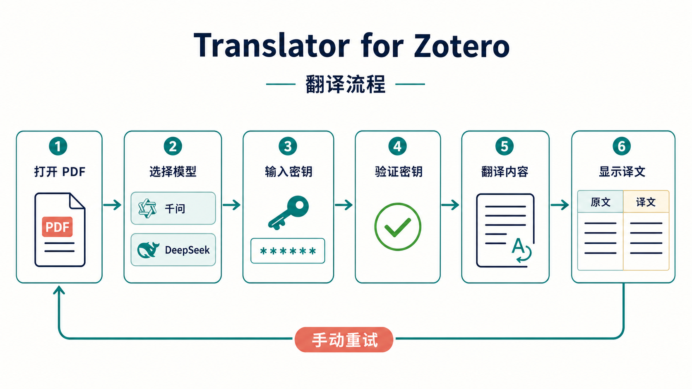

# Translator for Zotero 📚✨

让论文阅读变得更轻松：在 Zotero 里打开 PDF，可以自动翻译标题和摘要，也可以翻译手动选中的正文，并直接阅读、选择和复制简体中文译文。🌏💡

> 当前版本：`1.2.0`
>
> 适用环境：Zotero 9.x · 内置 PDF Reader · 普通 PDF 主视图
>
> 当前定位：面向 Zotero 9.x 的本地发布版本，欢迎通过 Issue 反馈使用体验 🧭

---

## 📚 目录

- [🌟 这是什么](#-这是什么)
- [✨ 能做什么](#-能做什么)
- [🗺️ 项目流程与架构](#️-项目流程与架构)
- [🚀 三分钟快速上手](#-三分钟快速上手)
- [🧰 安装前准备](#-安装前准备)
- [📥 安装插件](#-安装插件)
- [🔐 配置翻译模型](#-配置翻译模型)
- [🖥️ 使用右侧栏](#️-使用右侧栏)
- [📝 翻译标题和摘要](#-翻译标题和摘要)
- [🔤 翻译 PDF 选区](#-翻译-pdf-选区)
- [🔄 切换模型与重试](#-切换模型与重试)
- [💾 缓存和数据保存](#-缓存和数据保存)
- [🛡️ 隐私、安全与费用](#️-隐私安全与费用)
- [🧯 常见问题与排查](#-常见问题与排查)
- [🚧 当前限制](#-当前限制)
- [🛠️ 从源码构建](#️-从源码构建)
- [🤝 开发交接](../PROJECT_HANDOFF.md)
- [🔗 官方资料](#-官方资料)

## 🌟 这是什么？

**Translator for Zotero** 是一个 Zotero PDF 阅读辅助插件，专注于“边读边译”这件事：

- 📄 自动寻找论文首页的标题和摘要；
- 🇨🇳 自动生成简体中文译文；
- 🖱️ 翻译你手动选中的段落或句子；
- 📄 一键提取并翻译当前 PDF 页的英文正文；
- 🧩 尽量保留 PDF 的单栏、双栏和段落结构；
- 🪄 将译文直接覆盖显示在 PDF 阅读页面上；
- 🔁 可以在原文和译文之间来回切换；
- 🧠 支持在千问与 DeepSeek 之间选择当前翻译模型。

它不会修改原始 PDF，也不会把翻译内容写回 Zotero 的原生批注。译文主要用于当前阅读过程，并在本机保留缓存。📖

## ✨ 能做什么？

### 🔍 读论文时快速理解

打开一篇英文论文后，先看首页标题和摘要，快速判断论文是否值得精读。遇到不熟悉的段落，再单独选中翻译，不必把整篇 PDF 复制到其他软件里。⏱️

### 🧱 尽量适应复杂版式

插件会尝试识别：

- 普通单栏正文；
- 左右双栏正文；
- 跨栏标题或摘要；
- 多行标题；
- 多段摘要；
- 选区中的连续视觉行；
- PDF 中没有清晰段落标签的选区。

对于复杂的学术排版，插件会优先保证“不误覆盖不相关内容”。因此某些情况下宁可提示定位失败，也不会随意把译文放到错误位置。🎯

### 🖱️ 原文和译文自由切换

翻译成功后，每个页面左上角会显示独立切换按钮：

```text
显示原文：隐藏当前页全部译文，恢复底层 PDF 文字选择
显示译文：恢复当前页全部译文，可拖拽选择并复制
```

译文覆盖块本身不再承担切换操作，因此可以直接拖拽选择和复制；按钮只影响所在页面，不影响其他页。🔬

## 🗺️ 项目流程与架构

下面两张图把插件的“使用路径”和“内部协作方式”放在一起说明。它们不要求你理解代码，第一次安装前快速浏览一遍，就能知道每个按钮和状态灯分别在做什么。🧭

### 🔁 从打开 PDF 到看到译文



整个过程可以概括为：打开 PDF → 选择模型 → 输入对应密钥 → 验证 → 翻译 → 显示译文。验证或翻译遇到问题时，插件会给出失败状态；覆盖块短暂倒计时后会自动移除，不会遮住原文，用户可以重新点击“翻译”按钮手动重试。⏱️

### 🧩 插件内部如何协作


- 🖥️ **用户界面**负责模型选择、密钥输入、状态反馈和选区翻译入口；
- 🧠 **翻译核心**负责选择当前 Provider、组织请求、校验结果、渲染覆盖层，并处理失败倒计时；
- 🔐 **本地服务**负责把密钥交给 Zotero 登录管理器，把翻译结果按 Provider/Model 隔离缓存到 SQLite；
- ☁️ **云端接口**只接收当前翻译所需的文本和密钥，不会把另一个模型的配置自动混用。

切换模型只影响下一次翻译或重试；已经发出的请求不会被强制取消，当前模型的缓存也不会与另一个模型混用。🔒

## 🚀 三分钟快速上手

如果你只想马上开始阅读，可以按下面的流程操作：

1. 📥 安装插件并重启 Zotero。
2. 📄 打开一篇带文字层的英文 PDF。
3. 🧭 在右侧栏打开 **Translator for Zotero**。
4. 🤖 选择 `千问` 或 `deepseek`。
5. 🔑 输入对应模型的 API Key，点击“保存”。
6. 🟢 等待状态灯变绿。
7. 🖱️ 选中 PDF 中的一段文字并点击“翻译”。
8. 🎉 阅读或复制译文，需要核对时点击页面左上角“显示原文”。

第一次使用建议先选择一两句话进行测试，确认密钥、网络和模型都正常后，再翻译较长段落。🌱

## 🧰 安装前准备

请先确认以下条件：

- ✅ 已安装 Zotero 9.x；
- ✅ PDF 可以在 Zotero 内置 PDF Reader 中打开；
- ✅ PDF 中包含可复制的文字层；
- ✅ 网络可以访问所选择的模型服务；
- ✅ 已准备至少一个可用 API Key；
- ✅ 账户拥有足够额度或调用权限。

### 📌 关于 PDF 文字层

如果 PDF 是扫描图片，鼠标无法选中文字，插件就无法准确知道文字位置。此时需要先使用 OCR 工具为 PDF 添加文字层，再回到 Zotero 中阅读。

一个简单判断方法是：

1. 用鼠标拖选 PDF 中的一句话；
2. 尝试复制并粘贴到记事本；
3. 如果复制出来是空白、乱码或整页图片，通常说明 PDF 缺少可用文字层。

## 📥 安装插件

### 方法一：拖拽 XPI 安装（推荐）

1. 获取插件文件：

   ```text
    dist/Translator-for-Zotero-1.2.0.xpi
   ```

2. **不要解压** `.xpi` 文件。
3. 打开 Zotero。
4. 打开菜单：

   ```text
   工具（Tools） → 插件（Plugins）
   ```

5. 将 `.xpi` 文件拖入插件窗口。
6. 在弹出的确认窗口中选择安装。
7. 完全退出并重新打开 Zotero。
8. 打开 PDF，在右侧栏寻找 **Translator for Zotero**。

Zotero 官方推荐将 `.xpi` 文件拖入 Plugins 窗口安装。插件拥有较高的本机访问权限，请确认文件来源可信后再安装。🔒

### 方法二：从插件窗口选择文件

如果拖拽没有反应，可以尝试：

1. 打开 `工具（Tools） → 插件（Plugins）`；
2. 点击插件窗口中的齿轮菜单；
3. 选择“从文件安装插件”或类似选项；
4. 选择 `.xpi` 文件并确认；
5. 重启 Zotero。

### 🔄 更新插件

安装新版本时，选择新的 `.xpi` 文件即可。若 Zotero 没有立即显示更新：

1. 关闭并重新打开 Zotero；
2. 检查插件窗口中的版本号；
3. 如果旧版本仍然存在，可以先移除旧版本，再安装新版本。

通常情况下，更新插件不会自动删除已经保存的 API Key 和本地翻译缓存。💾

### 🗑️ 卸载插件

1. 打开 `工具（Tools） → 插件（Plugins）`；
2. 找到 **Translator for Zotero**；
3. 选择移除或卸载；
4. 重启 Zotero。

卸载后，插件不会自动清理登录管理器中的密钥或本地缓存。如果你准备彻底清理，请先在插件侧栏中删除对应模型的密钥。🧹

## 🔐 配置翻译模型

插件支持两个模型。它们的密钥彼此独立，互不覆盖。你可以只配置其中一个，也可以两个都配置。🔑

### 🟣 配置千问

当前千问翻译模型为：

```text
qwen-mt-plus
```

配置步骤：

1. 登录阿里云百炼/Model Studio 控制台；
2. 进入中国大陆的北京地域；
3. 创建或复制一个可用 API Key；
4. 确认账户有权调用千问翻译模型；
5. 在插件侧栏顶部选择“千问”；
6. 把 API Key 粘贴到输入框；
7. 点击“保存”；
8. 等待状态灯变绿。

💡 本版本已经把普通用户需要的服务配置放在插件内部，用户只需要输入密钥，不需要填写其他高级参数。

### 🔵 配置 DeepSeek

当前插件注册的 DeepSeek 模型为：

```text
deepseek-v4-flash
```

配置步骤：

1. 在 DeepSeek 官方平台创建或复制 API Key；
2. 在插件侧栏顶部选择 `deepseek`；
3. 将 DeepSeek API Key 粘贴到输入框；
4. 点击“保存”；
5. 等待状态灯变绿。

⚠️ 千问 Key 和 DeepSeek Key 不能互换。请确认当前选中的模型与输入的密钥来自同一个服务商。

### 🟢 状态灯怎么看？

| 状态 | 说明 | 下一步 |
| --- | --- | --- |
| ⚪ 灰色 · 未输入 | 当前模型还没有保存密钥 | 输入密钥并点击“保存” |
| ⏳ 灰色 · 验证中 | 正在检查密钥是否可用 | 请稍等，不要重复点击 |
| 🟢 绿色 · 验证成功 | 当前模型可以开始翻译 | 打开 PDF 或选择文字 |
| 🔴 红色 · 验证失败 | 密钥、权限、网络或额度可能有问题 | 检查密钥后重试 |

保存时会先进行验证，验证成功后才会写入本机。验证失败不会覆盖之前已经保存的有效密钥。✅

## 🖥️ 使用右侧栏

打开 **Translator for Zotero** 后，你会看到一个简洁的配置面板：

### ① 模型按钮 🤖

顶部是两个等宽按钮：

- `千问`：使用 `qwen-mt-plus`；
- `deepseek`：使用 `deepseek-v4-flash`。

被选中的按钮会显示选中状态。模型选择是插件全局设置，不是按文献单独设置。

### ② 密钥输入框 🔑

- 输入框使用密码模式，不会直接显示完整密钥；
- 已保存密钥不会自动回填明文；
- 已保存时只显示类似 `sk-a***9xyz` 的脱敏提示；
- 如果要更换密钥，直接输入新密钥并点击“保存”。

### ③ 重试按钮 🔁

当验证失败时，状态文字右侧会出现重试图标。点击它可以重新验证当前模型的密钥。

### ④ 重置按钮 🗑️

点击“重置”后会弹出确认提示。确认后只删除当前选中模型的密钥，不会影响另一个模型。

### ⑤ 保存按钮 💾

点击“保存”会执行以下流程：

```text
输入密钥 → 在线验证 → 验证成功 → 保存到本机
                         ↘ 验证失败 → 保留旧密钥，提示错误
```

验证过程中按钮会暂时禁用，避免重复发送请求。⏳

## 📝 翻译标题和摘要

### 自动翻译流程

1. 确认当前模型状态灯为绿色；
2. 打开一个带文字层的 PDF；
3. 确保 Zotero 中存在该 PDF 的父条目；
4. 确认父条目的 `title` 和 `abstractNote` 字段有内容；
5. 等待插件识别首页版面；
6. 查看标题和摘要位置的翻译状态。

插件会尽量识别首页中的标题和摘要区域，并将译文覆盖到相应位置。对于论文首页常见的作者、机构、日期、DOI、关键词等信息，插件会尽量避免把它们误并入摘要。🧭

### 侧栏重试

如果某个区域定位失败，可以使用：

- **重试标题**：只重做标题识别和翻译；
- **重试摘要**：只重做摘要识别和翻译；
- **全部重试**：同时重做标题和摘要。

重试会重新发起请求，但不会清除已经成功的选区译文。🔄

### 标题和摘要的排版

- 标题通常保持居中；
- 摘要会尽量保留原始段落结构；
- 多栏摘要会按栏位分别处理；
- 插件会根据可用区域调整中文字号和行距；
- 如果区域太小，插件可能保留原文并显示诊断信息，而不是生成遮挡严重的译文。

## 🔤 翻译 PDF 选区

### 基本步骤

1. 在 PDF 中按住鼠标左键拖选一段英文；
2. 松开鼠标，等待选区弹窗出现；
3. 点击弹窗底部居中的 **翻译** 按钮；
4. 等待译文覆盖层出现；
5. 可以直接拖拽选择并复制译文；需要核对原文时使用页面顶部或底部的按钮切换。

译文会在不越出原文区域的前提下联合调整字号和行距，尽量使用覆盖块的可用高度。插件只在当前页及前后各一页挂载覆盖层，并复用坐标和排版结果，以减少长文档滚动时的重复计算。

### 选区小技巧 💡

为了得到更稳定的结果，建议：

- ✅ 一次选择一个完整段落；
- ✅ 尽量不要从一栏拖到另一栏；
- ✅ 避免同时选中页眉、页脚、图注和正文；
- ✅ 遇到公式、表格或脚注时，分小段翻译；
- ✅ 选区太大时，拆成两到三次翻译；
- ✅ 选择后若没有弹窗，先点击 PDF 空白处，再重新拖选。

### 复杂双栏选区

插件会尽量判断选区中的视觉行属于左栏还是右栏，并分别显示译文。不过 PDF 的文字层有时会把两栏文字交错排列，因此复杂跨栏选区可能出现：

- 译文顺序不理想；
- 覆盖区域不完整；
- 只翻译了部分文字；
- 插件提示无法可靠定位。

遇到这些情况时，最有效的办法通常是缩小选区，按单栏、单段落重新翻译。🛠️

## 🔄 切换模型与重试

### 切换模型会发生什么？

- 🌐 下一次新翻译使用新选中的模型；
- 🔁 手动重试使用当前选中的模型；
- 🧾 已经完成的译文不会被自动删除；
- 💾 两个模型的缓存互相隔离；
- 🧵 已经进行中的请求不会被强制取消。

例如：

```text
正在使用千问翻译段落 A
        ↓ 此时切换到 DeepSeek
段落 A 继续由千问完成
下一次翻译段落 B 使用 DeepSeek
```

### 什么时候应该重试？

- 状态灯变红；
- 网络临时中断；
- 服务商短暂繁忙；
- PDF 页面刚刚加载完成；
- 第一次定位结果不理想；
- 更换了 API Key。

如果错误明显是密钥或权限问题，建议先检查密钥，再点击重试，不要连续快速点击多次。⚠️

## 💾 缓存和数据保存

### 翻译缓存

插件会在本机缓存已经成功的译文，以减少重复请求：

- 标题、摘要和选区段落分别缓存；
- 缓存会区分原始文本和目标语言；
- 千问和 DeepSeek 的结果分别保存；
- 同一文献重新打开时，可以优先读取已有结果；
- 重试按钮会绕过相应缓存并重新请求。

缓存文件使用本机 SQLite 数据库保存，当前版本没有单独的“历史记录”页面。📦

### API Key 保存

- API Key 保存到 Zotero/Firefox 登录管理器；
- 不写入翻译缓存数据库；
- 不写入普通页面文字；
- 不在侧栏中回填完整明文；
- 千问和 DeepSeek 使用不同的保存位置。

### 选择模型后的缓存

切换模型不会让一个模型“冒充”另一个模型的结果：

```text
千问译文  ≠  DeepSeek 译文
```

因此切换模型后，第一次翻译同一段文字可能会产生新的请求，这是为了保证结果和模型来源清晰可追踪。🔎

## 🛡️ 隐私、安全与费用

### 文本会发送到哪里？

插件只发送当前需要翻译的文本片段，以及翻译所需的语言信息。它不会把整个 PDF 文件作为文件上传，也不会修改原 PDF。

但是，标题、摘要和选中的正文仍然可能包含敏感信息。翻译前请考虑：

- 📄 未发表论文；
- 🧑‍⚕️ 患者或实验对象信息；
- 🏢 企业内部资料；
- 🔒 未公开项目内容；
- 🧪 受协议或机构规定保护的数据。

### API Key 安全守则 🔐

请务必遵守：

1. 不要把 API Key 发给其他人；
2. 不要把 API Key 放进 README、截图、Issue 或日志；
3. 不要把包含真实密钥的 XPI 分享出去；
4. 怀疑泄露时，立即在服务商控制台重置或撤销；
5. 定期查看服务商的调用量和费用；
6. 为 API Key 设置合适的权限和额度。

### 插件权限提示

Zotero 插件通常拥有访问 Zotero 数据和本机环境的较高权限。请只安装来自可信来源的插件文件，不要随意安装陌生 XPI。🛡️

### 费用提示 💰

模型服务可能按请求量、输入文本量或输出文本量计费。建议第一次使用时：

- 先翻译一两句话测试；
- 不要一次选中整篇论文；
- 检查服务商账户余额和用量；
- 在服务商控制台设置提醒或限制；
- 网络异常时不要连续重复点击。

## 🧯 常见问题与排查

### 1. 安装后找不到插件

请按顺序检查：

1. 是否安装的是 `.xpi` 文件，而不是解压后的文件夹；
2. Zotero 是否为 9.x；
3. 是否已经完全重启 Zotero；
4. 插件窗口中是否显示并启用了 Translator for Zotero；
5. PDF 是否在 Zotero 内置 Reader 中打开；
6. 是否打开了正确的右侧栏。

### 2. 侧栏显示了插件，但没有名称或图标

这通常与旧版本残留、Zotero 没有完全重启或安装包不完整有关。建议：

- 完全退出 Zotero 后重新启动；
- 在插件窗口确认版本号；
- 移除旧版本后重新安装；
- 不要手动修改 XPI 内部文件。

### 3. 千问验证失败：`401` 或 `403`

重点检查：

- 🟣 当前选中的是“千问”，不是 `deepseek`；
- 🗝️ 输入的是阿里云百炼/千问 API Key，而不是其他平台密钥；
- 🌏 使用的是中国大陆北京地域的 Key；
- ✅ Key 没有复制缺字符、空格或换行；
- 📊 账户有余额、额度和模型调用权限；
- 🧱 没有被 IP 白名单或组织权限限制。

修正后重新输入密钥并点击“保存”。如果仍失败，再点击重试图标。

### 4. DeepSeek 验证失败

请检查：

- 🔵 当前选中的是 `deepseek`；
- 🔑 使用的是 DeepSeek 官方 API Key；
- 🧾 Key 没有复制不完整；
- 💰 DeepSeek 账户有可用额度；
- 🌐 网络或代理没有阻止请求。

### 5. 保存失败后，旧密钥会不会丢失？

不会。插件采用“先验证、后保存”的方式：

```text
验证成功 ✅ → 新密钥保存
验证失败 ❌ → 旧密钥保留，新输入继续留给你重试
```

### 6. 为什么标题或摘要没有出现？

可能原因：

- PDF 没有文字层；
- Zotero 中没有正确的父条目；
- 父条目的标题或摘要字段为空；
- PDF 首页版式过于复杂；
- 当前密钥尚未验证成功；
- 网络请求失败；
- 服务商额度不足。

可以先确认状态灯为绿色，再点击“重试标题”“重试摘要”或“全部重试”。🔄

### 7. 为什么翻译覆盖位置不准确？

插件依赖 PDF 的文字层和页面坐标。以下内容可能影响定位：

- 双栏文字层顺序混乱；
- 扫描后 OCR 坐标不准确；
- 选区跨越栏缝或页脚；
- 选区包含公式、表格或浮动图注；
- 页面刚加载完成，文字数据尚未准备好。

建议缩小选区，选择一个完整的单栏段落后重试。📐

### 8. 扫描版 PDF 能不能直接翻译？

当前版本不包含 OCR，不能直接识别纯图片文字。请先为 PDF 添加文字层，再回到 Zotero 使用插件。

### 9. 为什么切换模型后又重新请求？

这是正常现象。两个模型的翻译结果和缓存彼此隔离，切换模型后不会直接复用另一个模型的结果。🔁

### 10. 为什么不会自动切换另一个模型？

当前版本会严格使用你选中的模型。千问失败时不会自动改用 DeepSeek，DeepSeek 失败时也不会自动改用千问，这样可以避免用户不知情地切换服务或产生额外费用。

## 🚧 当前限制

- 🖥️ 仅支持 Zotero 9.x 普通 PDF Reader 主视图；
- 🇨🇳 目标语言当前固定为简体中文（`zh-CN`）；
- 🧾 自动标题和摘要定位主要读取 PDF 第一页；
- 👪 自动标题和摘要依赖附件父条目的元数据；
- 🔍 不包含 OCR；
- 📚 不支持 EPUB、阅读模式和第二视图；
- 🧮 复杂公式、表格、脚注和浮动文本框可能影响定位；
- 🏗️ 没有文字层或页面数据读取失败时，不会伪造译文位置；
- 🌏 当前千问配置面向北京地域 API Key；
- 🔀 当前不会在千问和 DeepSeek 之间自动切换；
- 🗂️ 当前没有翻译历史浏览、导出或批量管理页面；
- 📈 模型价格、额度、速率限制和服务政策以服务商最新规则为准。

## 🧭 推荐阅读流程

如果你要阅读一篇较长的英文论文，可以尝试：

1. 🗂️ 先在 Zotero 中整理好父条目和 PDF 附件；
2. 🧾 确认父条目的标题和摘要字段完整；
3. 🟢 配置并验证一个模型；
4. 👀 先阅读自动生成的标题和摘要译文；
5. 🖍️ 遇到关键段落时，只选中一段进行翻译；
6. 📌 对术语、数字和结论点击覆盖层核对原文；
7. 🔄 对失败的标题、摘要或段落单独重试；
8. 🧠 需要比较风格时，再切换另一个模型翻译同一段。

这样可以减少不必要的请求，也更容易保留自己的阅读节奏。☕📖

## 🛠️ 从源码构建

如果你拿到的是源码目录，可以在项目根目录运行：

```powershell
.\tools\build_reader_selection_replacer_test_xpi.ps1
```

构建产物位于：

```text
dist/Translator-for-Zotero-1.2.0.xpi
```

这是本项目唯一受支持的打包入口。版本号只在 `manifest.json` 中维护，构建脚本会自动读取版本并执行以下检查：

- `manifest.json`、`bootstrap.js` 和 XPI 文件名的版本必须一致；
- Zotero 兼容范围必须为 `9.0` 至 `9.*`；
- Zotero 安装清单必须包含经过验证的 `applications.zotero.update_url`；
- XPI 根目录必须直接包含 `manifest.json` 和 `bootstrap.js`；
- 包内文件必须与固定清单完全一致，不能缺失或混入临时文件；
- 先生成并校验临时包，全部通过后再替换正式 XPI；
- 构建完成后输出文件大小和 SHA-256 校验值。

不要手工压缩源码目录、不要向脚本传入独立版本号，也不要直接修改生成后的 XPI。

需要在另一台电脑继续开发、验收或发布时，请按仓库根目录的 [PROJECT_HANDOFF.md](../PROJECT_HANDOFF.md) 操作。

开发者可以运行以下检查：

```powershell
node --check zotero-reader-selection-replacer-test/bootstrap.js
node --check zotero-reader-selection-replacer-test/translation-service.js
node --check zotero-reader-selection-replacer-test/page-data-body-extractor.js
node tests/test_reader_selection_replacer_translation.js
node tests/test_reader_selection_replacer_bootstrap.js
node tests/test_reader_selection_replacer_front_matter.js
```

构建和发布前请确认：

- 🚫 源码中没有真实 API Key；
- 🚫 测试文件中没有真实 API Key；
- 🚫 XPI 中没有用户的登录管理器数据；
- ✅ 版本号、README 和 XPI 文件名一致；
- ✅ 只打包预期的插件文件；
- ✅ 完全退出并重启 Zotero，确保旧版本的待卸载/待更新状态已经完成；
- ✅ 使用测试密钥完成验证后，再进行正式发布。

## 🔗 官方资料

- [Zotero 官方插件安装与权限说明](https://www.zotero.org/support/plugins)
- [阿里云百炼：获取 API Key](https://help.aliyun.com/zh/model-studio/get-api-key/)
- [阿里云百炼：Qwen-MT API 参考](https://help.aliyun.com/zh/model-studio/qwen-mt-api)
- [DeepSeek：Chat Completions API](https://api-docs.deepseek.com/api/create-chat-completion/)

遇到服务商接口、价格、模型权限或账户额度问题时，请优先查看对应服务商的最新官方说明。📘

## 📌 版本说明

### `1.2.0`

- 🧹 删除不稳定的整页正文提取、翻译按钮、页面任务状态和 `page-body` 请求链，只保留标题/摘要自动翻译与用户主动选区翻译；
- ↕️ 修复覆盖块高度测量被 `height: 100%` 干扰的问题，使用真实文本高度联合调整字号和行距，使译文在不溢出的前提下尽量填充原文区域；
- 🪶 保留当前页前后各一页的覆盖层虚拟化、按页增量更新、坐标缓存和排版缓存，减少长文档滚动时的重复工作；
- 🖱️ 页面顶部和底部保留同步的“显示原文/显示译文”入口，译文继续支持拖拽选择与复制；
- 📚 新增跨电脑开发交接文档，固定测试、打包、验包和发布流程；
- 📦 清理旧测试安装包，发布 `1.2.0` XPI。

### `1.1.1`

- 📄 曾引入实验性的当前页正文翻译流程；该功能因复杂版面可靠性不足，已在 `1.2.0` 中完整移除；
- ↕️ 页面顶部和底部提供同步控制栏，并改进覆盖层排版；
- 🪶 覆盖层虚拟化为当前页前后各一页，采用按页增量渲染及坐标、排版缓存；
- 🖱️ 使用页面级“显示原文/显示译文”按钮，译文覆盖层支持正常拖拽选择和复制；
- 🧭 修复 Zotero 冷启动时右侧栏管理器尚未就绪，导致插件已安装但侧栏未注册的问题；
- 🔁 增加主窗口加载后的注册重试，重新启动 Zotero 后无需再次安装插件；
- 🧩 规范 Zotero 9.0 兼容版本范围，并移除无效的更新地址。

### `1.1.0`

- ⚡ 密钥验证 5 秒超时，翻译请求 10 秒超时，并取消自动重试，失败后可手动重试；
- 🪶 缩小右键“翻译”按钮，改为更扁平的 42px 圆角样式；
- 🖼️ 使用全新文件名的纯图形千问与 DeepSeek 图标，避免旧 XPI 资源缓存；
- 🗺️ README 增加中文翻译流程图和系统架构图，方便快速理解插件工作方式；
- 🧭 验证失败状态显示 API Key 无效、请求超时或 HTTP 状态等简短原因；
- 📦 安装包版本升级为 `1.1.0`。

### `1.0.1`

- 🖼️ 更新千问和 DeepSeek 模型图标，图标只保留图形标志，不再显示内部文字；
- ⚡ 缩短密钥验证和翻译网络请求的超时与重试等待，便于快速排查密钥和接口问题；
- 📦 提升安装包版本，避免 Zotero 继续使用旧版 XPI 或旧资源缓存。

### `1.0.0`

- 🟣 千问翻译模型固定为 `qwen-mt-plus`；
- 🔵 DeepSeek 当前使用 `deepseek-v4-flash`；
- 🔑 千问和 DeepSeek API Key 独立保存；
- 🖥️ 侧栏只需要输入当前模型的 API Key；
- 🟢 增加验证状态灯、保存、重试和重置操作；
- 📝 支持标题、摘要和 PDF 选区翻译；
- 💾 保留按模型隔离的本地翻译缓存；
- 🔄 切换模型不会中断已经进行中的请求；
- 🛡️ 不自动切换模型，避免意外切换服务和产生额外费用。

感谢使用 Translator for Zotero！如果它帮你少查了一次词典、少复制了一次段落，那这次阅读就已经轻松了一点。🌱🎉
